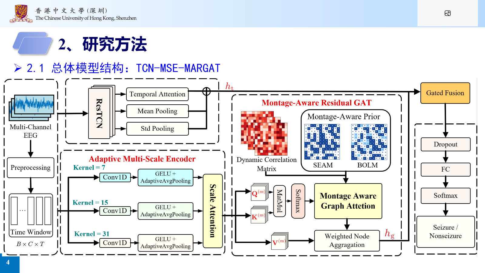
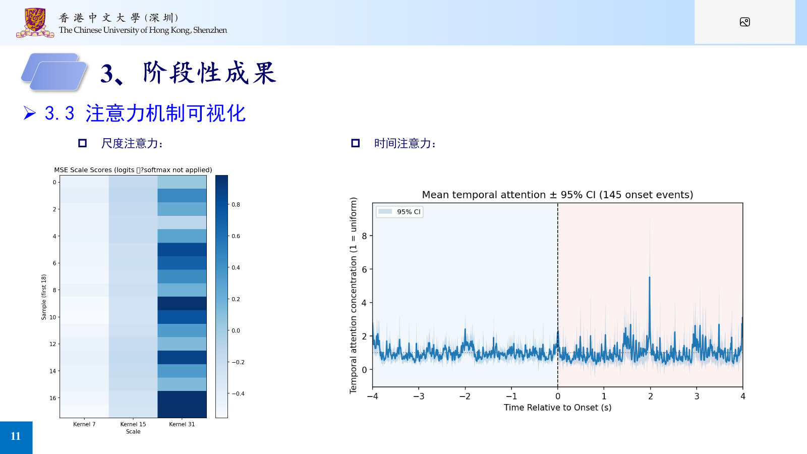
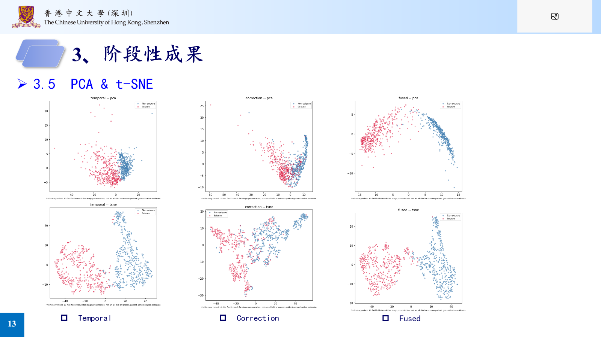

# TCN-MSE-MARGAT

面向跨受试者 EEG 癫痫发作检测的端到端 PyTorch 研究项目。模型将多尺度时序卷积、通道级多尺度编码与蒙太奇感知图注意力结合，用于同时建模发作相关的时间模式和双极导联之间的依赖关系。

<table>
  <tr>
    <td align="center"><strong>98.12%</strong><br>5 折交叉验证 Accuracy</td>
    <td align="center"><strong>88.65%</strong><br>Leave-one-case-out Accuracy</td>
  </tr>
</table>

> 上述数值采用最终研究汇报口径。5 折结果属于患者混合、窗口级评价；leave-one-case-out 完整留出一个 CHB-MIT case，更能反映跨案例泛化能力。两类结果的划分难度不同，不宜直接横向比较。

## 项目亮点

- 完整覆盖 EDF 解析、伪迹感知预处理、18 个双极导联对齐、多尺度分窗、训练和评估。
- 时序分支使用多尺度空洞卷积与注意力池化，捕获不同持续时间的发作模式。
- 图分支结合电极共享关系、双极方向与动态信号相关性，建模通道依赖。
- 同时支持患者混合交叉验证与 24-case leave-one-case-out 评估，并记录 Accuracy、Sensitivity、Specificity、F1、AUROC 和 AUPRC。

## 模型结构



该图来自研究进展汇报，展示 TCN 时序表征、多尺度通道编码、蒙太奇感知图注意力与门控融合的整体数据流。当前可执行实现见 [`src/model.py`](src/model.py)。

## 可视化结果

<p align="center">
  
  
</p>

左图展示发作事件附近的时序注意力响应；右图比较时序表征、图校正项与融合特征的类别分布。

## 项目结构

核心代码与配置包括：

```text
configs/       实验参数和少量 YAML 叠加配置
src/data.py    EDF 预处理、缓存、窗口和数据划分
src/model.py   TCN、MSE、MARGAT 与门控残差融合
src/train.py   训练、验证、早停和断点续训
src/evaluate.py 测试集评价
```

## 实验协议

输入为 `[batch, 18, time]`，1、2、4 秒窗口分别包含 256、512、1024 个采样点。预处理采用 0.5–70 Hz 零相位带通、60 Hz 陷波、18 个统一双极导联和逐通道 Z-score。

本项目按已确定的方案，使用每名患者的全部记录计算归一化均值和标准差，然后再划分数据。这是 **transductive** 协议，因为验证集和测试集信号参与了归一化统计量计算。混合五折还采用窗口级分层随机划分，并允许相邻或部分重叠窗口跨集合。因此，该结果属于患者混合条件下的窗口级评价，可能偏乐观，不能证明对未见患者的泛化能力。LOPO 会完整留出测试患者，但归一化仍是 transductive。

本项目的 LOPO 实验严格按 24 个 CHB-MIT case 执行。原始文件名中的 `chb17a`、`chb17b` 和 `chb17c` 仅在 LOPO 制品中统一映射为 `chb17`，最终 fold ID 为 `chb01` 至 `chb24`。PhysioNet 说明 `chb01` 与 `chb21` 来自同一位受试者，因此本文档将该协议称为 **24-case LOPO** 或 leave-one-case-out，而不把它表述为 24 位彼此独立的未见患者。

发作时间解析同时支持 `Seizure Start Time` 和 `Seizure 1 Start Time` 两种官方 summary 格式，并核对每个文件声明的发作次数。缓存版本 2 之前生成的制品会遗漏无编号条目；这些旧 mixed-10-fold 结果只能作为历史结果保留，正式 corrected mixed-5-fold 实验需要重新准备数据并重新训练。

发作窗口使用 75% 重叠；与发作区间重叠至少 50%时标为发作。非发作窗口与发作边界保持 30 秒距离。每个训练、验证和测试子集分别将非发作窗口下采样至约 1:1。

## 缓存设计

原始数据目录 `/workspace/data/public/Epilepsy/CHB-MIT` 只读。首次预处理写入：

```text
/workspace/output/prepared/
  records/             三种窗口共享的连续滤波信号
  manifest.json        记录、患者和发作区间
  normalization.npz    患者级 transductive 统计量
  windows/{1,2,4}s.*   三种独立窗口索引
  splits/              协议、窗口、随机种子和折号对应的划分
```

上述 `/workspace/output/prepared/` 保留给 mixed-window 制品。24-case LOPO 使用独立目录 `/workspace/output/prepared_lopo_24case/`，避免重建或覆盖 mixed manifest、归一化和窗口索引。`configs/lopo.yaml` 是唯一启用 `data.merge_chb17: true` 的配置；mixed 配置不会启用该映射，原有 mixed 划分和制品语义保持不变。

滤波后的 EEG 不会重复保存三份。修改滤波、通道或窗口参数后，程序会拒绝静默复用旧缓存；确认需要重建时添加 `--force`。

训练默认只将当前折的 train、validation 和 test 窗口物化到内存，不会载入完整的 61 GiB 连续记录缓存。物化阶段按记录和时间顺序读取以减少机械盘随机访问，后续 epoch 直接从内存取样。服务器实测 2 秒第 0 折约需 1.13 GiB，低于容器的 32 GiB 内存上限。内存模式会主动使用零个 DataLoader worker；不要通过增加 worker 绕过该设置。内存不足时可将 `train.cache_in_memory` 设为 `false`，恢复原 mmap 路径。

## GPU 服务器使用

代码放在 `/workspace/project`，缓存、checkpoint 和指标写入 `/workspace/output`。不要在登录容器中直接运行长时间训练；正式任务通过 `lab-submit` 提交，最大时长为 1–8 小时。

```bash
cd /workspace/project
python --version
python -m pip install -r requirements.txt
python -m compileall -q src
python -m pytest -q
```

先用调度任务检查 PyTorch 能否看到分配的 GPU：

```bash
lab-submit pytorch 1 python -c "import torch; print(torch.__version__); print(torch.cuda.is_available()); print(torch.cuda.get_device_name(0))"
lab-status
```

首次准备共享缓存和三种窗口索引：

```bash
lab-submit pytorch 8 python -m src.data configs/base.yaml --prepare --windows 1 2 4
```

训练混合五折中的第 0 折、2 秒窗口：

```bash
lab-submit pytorch 8 python -m src.train configs/base.yaml configs/mixed_5fold.yaml configs/window_2s.yaml --fold 0
```

真实数据 profiling 确认 DataLoader 等待显著下降后，将五折分别提交为五个独立任务：

```bash
for fold in {0..4}; do
  lab-submit pytorch 8 bash -lc "cd /workspace/project && /usr/bin/python -m src.train configs/base.yaml configs/mixed_5fold.yaml configs/window_2s.yaml --fold $fold"
done
```

每折拥有独立运行目录和最长 8 小时时限；单折失败或超时不影响其他折。不要在 profiling 通过前提交上述循环。

### 24-case LOPO

先在独立目录重建三种窗口的 LOPO 制品：

```bash
cd /workspace/project
/usr/bin/python -m src.data configs/base.yaml configs/lopo.yaml --prepare --windows 1 2 4 --force
```

`--force` 用于覆盖缓存版本 2 之前的不完整标签制品，不需要先手动删除 prepared 目录。

正式提交训练前，必须检查所选窗口的 case、归一化和类别完整性：

```bash
/usr/bin/python -m src.data configs/base.yaml configs/lopo.yaml configs/window_2s.yaml --check-lopo --windows 2
```

只有输出同时满足以下条件时才能提交 24 个训练任务：

- `case_count` 为 24；
- `case_ids` 和 `fold_ids` 恰好为 `chb01` 至 `chb24`；
- `normalization_arrays` 为 48；
- 命令未报告任何 case 缺少发作或非发作窗口。

LOPO 留出 `chb01` 的单折示例：

```bash
lab-submit pytorch 8 bash -lc "cd /workspace/project && /usr/bin/python -m src.train configs/base.yaml configs/lopo.yaml configs/window_2s.yaml --fold chb01"
```

24 折应作为 24 个独立调度任务提交，不要串行放进一个 8 小时任务。每折训练完成后都要显式评价 `best.pt`，保留各自的 `test_metrics.json`，最终报告 24 折逐折结果以及均值和样本标准差。

### GLWA 对齐的混合验证 LOPO

`configs/lopo_mixedval.yaml` 是独立的开发协议，不覆盖上述 `configs/lopo.yaml` 基线。每折仍完整留出一个测试 case；其余 23 个 case 的窗口合并后，按标签分层随机抽取 10% 作为验证集。训练和验证可能包含同一 case、同一记录甚至相邻重叠窗口，因此该验证方式弱于完整 case 留出的基线，不能描述为患者独立验证。

该协议的训练集保留全部发作窗口，并最多抽取 2 倍非发作窗口；验证集和测试集保持约 1:1。最佳阈值和 checkpoint 只依据验证集 balanced accuracy 选择。它复用 `/workspace/output/prepared_lopo_24case`，不会重建或覆盖现有 mixed-window 制品；新划分写入带配置指纹的独立 split 目录。

先只提交 chb01 和 chb02 两个开发折：

```bash
lab-submit pytorch 8 bash -lc "cd /workspace/project && /usr/bin/python -m src.train configs/base.yaml configs/lopo_mixedval.yaml configs/window_2s.yaml --fold chb01"
lab-submit pytorch 8 bash -lc "cd /workspace/project && /usr/bin/python -m src.train configs/base.yaml configs/lopo_mixedval.yaml configs/window_2s.yaml --fold chb02"
```

检查两个运行目录中的 `diagnostics.json`、`best.pt` 和 `test_metrics.json`，确认 specificity 与 precision 的提升并非以不可接受的 sensitivity 损失换取。冻结配置前不要提交其余 22 折。

### 从本机分支上传到服务器

本机 Git 分支仅用于版本管理，服务器不需要存在同名分支。确认本地修改和测试后，可在项目根目录直接同步运行所需文件：

```powershell
scp -r configs src tests docs README.md requirements.txt lab-server:/workspace/project/
```

上传后先在服务器检查 `/workspace/project/src`、`configs` 和 `README.md` 位于项目根目录，且不存在额外的项目名嵌套层。不要上传本地缓存、checkpoint、`tmp/`、输出目录或虚拟环境。

任务超时或中断后从持久化的 `last.pt` 恢复：

```bash
lab-submit pytorch 8 python -m src.train configs/base.yaml configs/mixed_5fold.yaml configs/window_2s.yaml --fold 0 --resume /workspace/output/runs/运行目录/last.pt
```

使用最佳验证 checkpoint 进行测试集评价：

```bash
lab-submit pytorch 1 python -m src.evaluate --checkpoint /workspace/output/runs/运行目录/best.pt
```

训练目录同时保存 `config.yaml`、`environment.json`、`train.log`、`last.pt` 和 `best.pt`。测试结果写入同一目录下的 `test_metrics.json`。任务状态和调度日志使用 `lab-status`、`lab-cancel 任务ID` 与 `/workspace/logs/job-*.log` 查看。

## 评价与复现

验证集用于选择最佳 epoch 和 F1 阈值，测试集不参与模型选择。评价输出 accuracy、sensitivity、specificity、precision、recall、F1、AUROC、AUPRC 和混淆矩阵。每折都应保留独立结果，最终报告全部折、均值和标准差，不只报告最佳一折。

随机种子默认是 42，Python、NumPy、PyTorch 和 CUDA 都会设置种子，同时关闭 cuDNN benchmark。不同 CUDA、驱动和算子版本之间仍可能存在少量非确定性。
